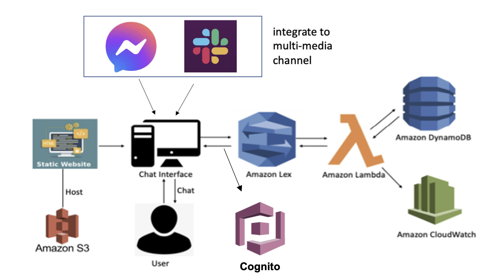

# Serverless_Restaurant_Reservation_Chatbot

Individually designed the whole cloud system architecture for the app and lead a team of 4 to implement software features. 
Chatbot creating: AWS Lambda, Amazon Lex, DynamoDB, CloudWatch  
Integrate to own website: AWS Cognito, AWS SDK, AWS S3  
Integrate to multi-media channel(fb, slack): webhook, postback url, OAuth handshake  
The following is an overview of System Architecture for the whole application.  

